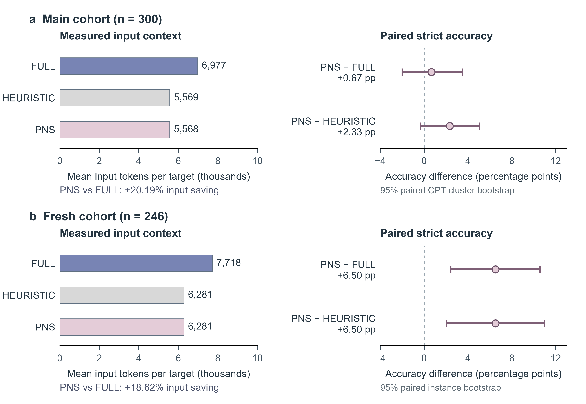

# Electronic Supplement to Auditable Reasoning Trajectory Compression

This supplement preserves extended protocols, historical experiments, diagnostic audits and resource accounts supporting the focused dissertation. It is an archival companion: the original section and table labels are retained within quoted source material, and current chapter references should be read in the dissertation. Current files are indexed in the [evidence guide](../docs/EVIDENCE.md).

## S1 Historical protocols and exploratory experiments

The earlier banks and outcome-selected challenge sets used different protocols from the current Phase56 deployment policy. Their positive and inconclusive results are retained together as historical evidence.

### 3.6 Protocol versions and implementation records

Table 3.1 distinguishes the historical protocols from the completed follow-up deployment policy using the method summary, historical audits and Phase56 records [E1, E2, E3]. It maps the versions and their selection rules rather than combining them into a single algorithm.

Table 3.1: Distinct protocols in the historical record.

| Protocol | Documented operation | Selection and failure policy | Interpretation |
| --- | --- | --- | --- |
| General PNS description | Two continuations per arm in the described rule | Parent fallback described | Method documentation; execution must be checked separately |
| Dynamic precheck | DELETE and deliberately erroneous REPLACE probes | Sensitivity and stress testing | A diagnostic intervention, not the same as candidate improvement |
| Historical exhaustive bank | Two continuations per branch; local_deterministic_v1 checks | Historical accepted bank and separate cost ledger; zero external path judges | Source of the 100-question ICL pilot |
| Phase56 strict protocol | Three-to-five valid matched rounds; at most five raw attempts per lineage; invalid outputs do not vote | Acceptance checks followed by shortest-chain selection; no fallback during construction | Separate frozen construction batch |
| Follow-up deployment policy | Uses 52 accepted Phase56 traces within 56 fixed identities | Four unaccepted items retain exact parent traces in PNS and heuristic arms | Completed deployment policy; original construction decisions retained |

The Phase56 execution journal contains 7,947 KEEP and 6,561 DELETE generation records, with no REPLACE or replacement-generation records [E3]. REPLACE is an implemented conditional branch, but it was not triggered in this run. Among the 52 selected traces, 30 come from DELETE and 22 from KEEP. The historical run's 94 REPLACE continuations belong to the earlier protocol. These counts do not provide a within-Phase56 comparison of three executed interventions.

The Phase56 database contract specifies three initial valid matched rounds, at most five valid rounds and at most five raw attempts per lineage. Invalid outputs consume attempts but do not vote. The archived implementation makes the stopping rule explicit. Let d be the number of correct KEEP continuations minus the number of correct DELETE continuations. After three matched rounds, it triggers REPLACE if d > 2 and stops without REPLACE if d + 2 <= 0; otherwise it continues to five rounds without a decision at round four. At five rounds, REPLACE is triggered if d > 0. This trigger is separate from candidate acceptance, which requires at least three correct votes and an exportable shorter candidate at the three- or five-round decision point. These are construction rules, not tests of step necessity. The execution journal contains no REPLACE calls. Requested suffix and replacement caps are 8,000 and 1,024 tokens, respectively, subject to the context constraint; the replacement cap was unused in this run.

The execution manifest records model identifiers, application programming interface (API) endpoints, tokenizer information, sampling settings, budgets and retry rules where available. The electronic evidence includes the archived decision, request and recovery code; execution claims are tied to the dated runtime journals. Scientific raw-attempt limits and separately recorded technical recovery are distinguished in the construction accounting in Section 6.5. Where a server-side revision is unavailable, the recorded API identifier and execution date delimit what can be reproduced. Missing historical settings cannot be recovered reliably from a newer configuration file.

### 5.2 Historical trace construction

The historical exhaustive PNS bank contains 56 compressed traces. Aggregate reasoning tokens decline from 128,764 in the parents to 79,021 in the selected candidates, a reduction of 49,743 tokens or 38.63% [E1]. This is a bank-level result for the selected historical examples. It does not estimate compression coverage over all 10,112 baseline questions and does not establish a per-type acceptance rate.

The 30 August snapshot of the stricter Phase56 protocol recorded 52 accepted traces from 56 planned parents. A closure manifest created from the original records on 10 September retained those 52 accepted outputs and closed the remaining four as failed or unaccepted, without modifying the historical databases or generating new candidates [E3]. Recalculation gave 116,826 parent reasoning tokens and 75,074 compressed reasoning tokens across the 52 accepted pairs, a reduction of 35.74%. The final acceptance rate was 52/56, or 92.86%.

The historical snapshot attributes one accepted Phase56 trace to review by DeepSeek V4 Pro and 51 to GPT-5.5 [E1]. These records describe heterogeneous judging, not a controlled comparison of judges. Subsequent audits add assessments without replacing the original decisions. The acceptance rate retains all 56 planned parents in its denominator, regardless of the downstream fallback policy.

The selected-lineage audit verified exact reconstruction for all 52 accepted traces: the retained prefix concatenated with the generated suffix equalled both the recorded chain and the selected artefact [E3]. Item q30359 was recovered from its historical generation-1 sidecar while preserving the original request state. Exact reconstruction establishes recorded trace provenance, without independently establishing semantic correctness. The four unaccepted identities were q19407 and q24494 in ETT, and q29833 and q30257 in deterministic counterfactual reasoning.

Table 5.1: Historical aggregate trace lengths.

| Bank and date | Paired traces | Full reasoning tokens | Compressed reasoning tokens | Reduction |
| --- | --- | --- | --- | --- |
| Historical exhaustive bank, 17 August | 56 | 128,764 | 79,021 | 38.63% |
| Phase56 closure, 10 September | 52 accepted of 56 planned | 116,826 | 75,074 | 35.74% on accepted subset |

The 52 accepted Phase56 pairs have a median item-level reduction of 38.78%, with an interquartile range of 30.01%–45.89% and a range of 7.65%–69.22%. These percentages use the common tokenizer and complete reasoning strings; quartiles use linear interpolation. The mean item-level reduction is 37.42%, which differs from the 35.74% ratio of aggregate lengths because the parents have different lengths. These measurements answer the length component of RQ1 but do not establish the frequency of semantic errors.

### 5.3 Historical paired few-shot comparison

Recomputation of the historical scored outputs confirms that FULL_COT and PNS_COT each obtained 71 strict correct answers out of 100 [E2]. PNS_COT corrected seven FULL_COT errors and introduced seven new errors. Sixty-four questions were correct in both conditions, and 22 were incorrect in both. The exact two-sided McNemar p-value is 1. The exploratory 95% question-level percentile-bootstrap interval for the accuracy difference is −7 to +7 percentage points.

Table 5.2: Historical two-shot challenge-set results recomputed from stored outputs. All conditions have 100 completed target records. Token totals are reported online usage and exclude bank construction.

| Condition | Strict correct | Format valid | Prompt tokens | Completion tokens | Gain / loss vs FULL |
| --- | --- | --- | --- | --- | --- |
| FULL_COT | 71/100 | 100/100 | 671,354 | 147,121 | Reference |
| PNS_COT | 71/100 | 97/100 | 458,093 | 116,649 | 7 / 7 |
| Strong14 selector | 77/100 | 100/100 | 601,524 | 146,234 | 7 / 1 |

PNS_COT used 213,261 fewer prompt tokens, corresponding to 31.77% of the FULL_COT total. It also used 30,472 fewer completion tokens, a reduction of 20.71%. Adding the two reported categories gives 818,475 tokens for FULL_COT and 574,742 for PNS_COT, a 29.78% reduction in reported online token count. This combined percentage treats input and output tokens as counts rather than equally priced resources; it is not a monetary cost estimate.

Prompt use fell while observed strict accuracy remained 71/100 in both conditions. The paired interval still permits both harm and benefit, and all three format failures occurred in PNS_COT. Excluding invalid outputs would conceal those failures by changing the denominator, so the analysis retains all 100 targets.

The historical output cap was computed separately from each arm's prompt length, so a shorter prompt could receive a larger available cap. None of the three historical online conditions reported a length truncation, but the numerical caps were not equal by construction [E2]. The follow-up's common target-specific cap improves this control. It should not be attributed retrospectively to the pilot.

### 5.4 Selective compression with Strong14

The historical Strong14 variant obtains 77/100 strict correct answers with seven gains and one loss relative to FULL_COT. Its exact two-sided McNemar p-value is 0.0703125 [E2]. Its bank contains 14 compressed traces and 42 parent fallbacks, with 115,824 reasoning tokens compared with 128,764 in the full bank, a reduction of 10.05%. The rule replaces 62 of the 200 demonstration slots used across the 100 targets [E1, E2]. It therefore studies selective deployment of compressed traces, rather than replacement of every available demonstration.

Strong14 achieved 77/100 strict correct answers, compared with 71/100 for both FULL_COT and PNS_COT, while saving fewer prompt tokens than PNS_COT. The selector was explored on the same challenge targets, and the comparison did not establish an accuracy advantage over FULL_COT. A confirmatory evaluation requires a selection rule fixed before target outcomes are examined and a separately selected evaluation cohort.

## S2 Detailed configuration, generation and statistical records

These original methods retain the complete information-access rules, construction settings, model fields, cohort exclusions, generator seed and offset values, label/precision filters, and statistical assumptions. They provide detail for reproducing the abbreviated methods in the focused dissertation.

### 3.1 Problem definition and information access

Let x be a public causal problem, y its reference answer, and C0 the frozen reasoning text of a full parent response generated for x. Let C denote the reasoning used in a demonstration: the full parent reasoning, a compressed representation or a parent fallback. A demonstration is represented as (x, C, y), with its final answer supplied separately from the reasoning text. A target prompt contains a fixed instruction, k demonstrations and a new public problem xt. The target reference answer yt is used only after generation for scoring.

The method constructs a shorter C from C0 while preserving a record of how the candidate was obtained and checked. The acceptance conditions are distinct: the parsed answer must match y; the explanation must satisfy the chosen semantic review; and the complete candidate reasoning must be shorter than its parent under the declared tokenizer. These conditions are a selection rule, not a theorem that the candidate is semantically equivalent to C0 on every interpretation.

Reference answers and oracle computations are used for offline scoring and verification. Any access by the candidate generator must be reported as a construction factor. The target-prompt contract excludes target labels, reference reasoning, selection features derived from correctness and oracle outputs. Query-type routing is permitted only when the protocol supplies that feature at inference. Labelling a field “metadata” does not remove leakage if it encodes the target answer.

The Phase56 contract distinguishes generator and judge access [E3]. CLADDER reference reasoning is hidden from the generation model and target prompts, while its non-answer steps may be supplied to the semantic judge as advisory material. Neither an identical derivation nor a one-to-one match between steps is required. Provenance is established from the frozen Qwen parent and its stored segments. The contract therefore permits reference-assisted judging, giving the judge broader information access than the continuation model.

### 3.2 Parent selection and the construction denominator

The construction pipeline first identifies the source dataset and candidate question pool. Baseline traces are then filtered for a correct final answer, usable reasoning, and compatibility with the available segmentation and audit machinery. The selected parent text is frozen before search. Its identifier and content hash remain stable across all interventions so that later edits can be traced to an exact source.

Each filter changes the population to which the construction results apply. The available counts distinguish source questions, baseline records, usable answer-correct traces, the selected core and accepted compressed outputs. Incorrect parents, missing reasoning, answer exposure before a usable intervention, oracle disagreement and failed segmentation checks impose different limits on coverage and must not be treated as interchangeable exclusions.

The historical project inventory contains 10,112 baseline records and 9,239 answer-correct usable traces, with a static core of 256 candidates [E1, E2]. The core contains 231 deterministic-counterfactual questions, so it is strongly concentrated in one type. These values describe inventory and selection stages. They do not mean that 256 dynamically validated compressed traces were obtained. Likewise, the existence of a 56-entry historical bank does not establish completion of another protocol that happened to target 56 entries.

### 3.3 Lossless segmentation and answer exposure

For provenance, the parent is segmented into contiguous character spans. If span i is [ai, bi), the segments must cover the declared parent interval with no gaps and no overlap. Concatenating the stored segment text must reproduce that interval exactly. Whitespace and punctuation are included in the comparison. These checks prevent an intervention from being described as deleting one step when the implementation also normalised or omitted other text.

Segmentation is an operational decomposition rather than a unique semantic analysis. One segment may contain several calculations; a single causal operation may span several paragraphs. The segmentation rule and any human or model-assisted boundary decisions must therefore be versioned. A sensitivity analysis using another reasonable segmentation can test whether an observed local conclusion depends on those boundaries.

The earliest answer exposure is also marked. Exposure can be explicit, such as a final yes/no assertion, or semantic, such as stating the sign or conclusion that determines the answer before later calculations. Steps after this boundary cannot provide clean evidence about discovering the answer: the prefix may already tell the continuation what to produce. The method excludes these positions from claims about local step sensitivity while retaining the full text for provenance and length accounting.

The answer-exposure record requires both the flagged span and the detector's rationale so that the decision can be inspected. A literal “final answer” marker is too narrow a boundary, because earlier text may already commit to the scored conclusion. Conversely, an intermediate numerical value does not necessarily reveal the final answer. The detector's output therefore requires inspection rather than being treated as an infallible boundary.

### 3.4 Controlled continuation search

For a selected step si, let Pi be the prefix of the frozen parent preceding that step. KEEP supplies Pi followed by si; DELETE supplies Pi alone; and REPLACE supplies Pi followed by a recorded replacement ri. The continuation model then generates the remaining suffix through the protocol's continuation interface. Reconstruction records distinguish characters retained from the parent, characters supplied by the replacement and characters generated in the new suffix.

The search for each step is anchored independently to C0. A successful edit at an earlier step is not silently carried into the intervention at a later step. Otherwise the experiment would confound step position with cumulative changes and the candidate lineage would no longer describe a single local intervention. A multi-edit search can be defined, but it is a different algorithm and must have its own protocol.

When the protocol samples repeated continuations for a replacement, the replacement text is fixed before those repetitions. Generating a different replacement on each trial changes both the edit and the continuation sample. The resulting success fraction would then average over an unspecified replacement distribution. Freezing the replacement makes the tested object clear and allows the repeated outputs to be compared meaningfully.

### 3.5 Candidate acceptance and deterministic selection

Acceptance is evaluated on the complete reconstructed candidate, including any retained prefix and newly generated suffix. Measuring only the edited region or generated suffix could report a saving that disappears when the entire demonstration is assembled. The tokenizer and the exact text boundary used for counting are fixed in the protocol. Character counts are useful secondary checks but do not replace token counts.

Candidates are checked in four stages. Execution and parsing checks exclude incomplete responses, schema errors and missing answers. The answer check compares the parsed answer with the declared reference. Semantic review assesses the estimand, intervention or conditioning rule, numerical substitutions, consistency between factual and counterfactual worlds, and support for the conclusion. Protocols requiring strict compression finally check that the complete candidate reasoning is shorter than the parent's.

This consolidated semantic checklist defines the intended audit contract. Its execution must be established separately for each bank. The historical exhaustive PNS56 record uses local_deterministic_v1 path checks and reports zero external path-judge calls [E2]. It cannot be retroactively certified by the later Phase56 judges or the separate verifier replay. A deterministic acceptance label does not by itself establish that every element of the consolidated semantic checklist was independently validated.

When several candidates pass the acceptance checks, Phase56 selects by complete-chain Qwen token count, then character count, then candidate identifier [E3]. The records retain this ranking and each candidate's lineage. The deterministic rule prevents informal post hoc selection, but the chosen trace is still a product of search and screening. Its usefulness on other questions is assessed separately in the downstream evaluation.

Each parent has an explicit search status. Accepted means that a shorter candidate passed the protocol's checks and was selected. Exhausted means that the search reached its budget without an accepted candidate. Execution failure means that the requested procedure could not be completed, and pending identifies unresolved work. A deployment policy may return the original parent when compression fails, but those fallbacks are reported separately and do not count as compression successes.

### 3.7 Reusing the bank in few-shot prompts

The downstream comparisons use paired representations of the same demonstration bank: the full reasoning and the reasoning supplied by the compression-and-fallback policy. For each target, routing selects the same demonstration identities in the same order across the three demonstration conditions. Demonstration questions, final answers, example count and target instructions are fixed. Both completed follow-up cohorts use two demonstrations per target, as did the historical pilot [E1, E3, E6].

The follow-up introduces an explicit failure-aware deployment policy. The strict Phase56 construction has 52 accepted outputs among 56 planned identities, with accepted counts of 34 deterministic counterfactuals, nine NIE, six ATE, two NDE, and one ETT. Restricting the bank to accepted items would leave too few distinct ETT examples for same-type two-shot prompting. The downstream bank therefore retains all 56 identities and uses exact-parent fallback for the four unaccepted items. The ordinary-compression condition also leaves those four items at full length. Actual compressed and fallback slots are counted across target prompts. This deployment policy is separate from the strict no-fallback construction criterion; no fallback is relabelled as a compression success.

The completed follow-up experiments compare four conditions. ZERO supplies no demonstrations. FULL_COT uses the original full reasoning. PNS_COT uses the 52 accepted shorter traces and the four unchanged parent fallbacks. HEURISTIC_SHORT uses the executed deterministic length-matched extraction procedure described in Section 4.2, with the same four parent fallbacks. The PNS_COT comparisons with FULL_COT and HEURISTIC_SHORT assess the construction policies; comparison with ZERO also changes whether examples are present.

Input tokens are counted after the complete prompt is serialised for the model. The count includes instructions, demonstration questions and answers, reasoning, delimiters, target text and template overhead. Online input savings therefore refer to complete prompts, whereas demonstration-bank compression refers only to reasoning text.

### 4 Experimental Design

### 4.1 Evidence sets and their roles

The evidence is organised by experimental role. Development records informed construction and validation, and the historical challenge set supported exploratory comparisons. The completed 300-target follow-up used model-ID exclusions, while the separate 246-instance extension tested newly generated numerical configurations. These distinct roles and separation criteria apply even though all questions derive from CLADDER.

The historical challenge set contains 100 questions, with 20 from each of five query types: average treatment effect, deterministic counterfactual, effect of treatment on the treated, natural direct effect, and natural indirect effect. It was selected to contain 50 questions answered correctly and 50 incorrectly by a previous baseline [E1]. The resulting 50% baseline accuracy is partly a consequence of selection. It is not a fresh estimate of baseline performance on the benchmark population.

The overlap audit found 100 distinct meta.model_id values among the 100 challenge questions, but eight model IDs were shared with the static core and two with the 56 demonstration questions [E2]. The two IDs shared with the demonstration bank were 2063 and 3228. Thus question identifiers were disjoint, but model groups were not. The historical comparison is an exploratory evaluation with disjoint question IDs, not an instance-disjoint holdout. The follow-up applied exclusions by model_id rather than question identifier alone.

The main follow-up fixed 300 targets and four conditions—ZERO, FULL_COT, HEURISTIC_SHORT and PNS_COT—for 1,200 planned target-condition requests. A separate development smoke test used 10 targets and the same four conditions. Main-cohort exclusions covered the static 256-question core, the historical challenge set, and instance groups used in current development and audit work [E3]. Preparation checks found no model_id overlap between main targets and demonstrations, main and development targets, or development targets and demonstrations. Section 5.6 reports the terminal outcomes for all planned main requests.

Sampling used seed 20260910 and selected at most one question per model_id: 94 ATE, 54 deterministic counterfactual, 82 ETT, 20 NDE and 50 NIE targets. The 300 distinct model IDs corresponded to 271 numerical groups, each defined by its graph and complete conditional probability tables (CPTs). Sixteen repeated groups contained 45 questions, with at most four questions per group. The development smoke test used two questions per type from the historical challenge pool, excluding model IDs shared with demonstrations.

The complete-CPT audit found 23 targets sharing 14 numerical groups with the 56 demonstration questions, 54 targets sharing 27 groups with the static core, and 30 targets sharing 16 groups with the historical challenge set [E3]. The union contained 59 targets in 32 groups: all 54 deterministic-counterfactual targets, four ATE targets and one NDE target. These overlapping intersections cannot be added. Group identity required the same graph identifier and normalised complete probability tables; story, query and intervention direction could still differ. The read-only audit changed no targets or predictions.

All 300 targets came from the 10,112-question inventory for which baseline responses had already been generated. The follow-up therefore has prior experimental exposure, despite model-ID separation under the declared exclusions, and includes documented reuse of complete numerical SCMs. It is not an instance-independent holdout. Group identity in the CPT audit requires all conditional probability tables to match; a partial table match is insufficient.

### 4.1.1 Newly generated numerical instances

The fresh extension was fixed before accuracy from the running 300-target comparison was inspected [E6]. The retained cohort contains 246 newly generated numerical instances, each contributing one question: 94 ATE, 82 ETT, 20 NDE and 50 NIE. Generation used the unmodified official CLADDER generator at commit 3d2d1169b4b939a09048a6a75956c8972a93cc38. ATE and ETT used the frontdoor structure and smoking_frontdoor story; NDE and NIE used the mediation structure and six compatible CLADDER story templates. The extension did not include deterministic-counterfactual questions. The generation base seed was 2026092000, with type offsets of 0, 100000, 200000 and 300000; ordering used seed 2026092099. Question polarity alternated by accepted within-type index without selection for answer balance.

RandomBuilder independently proposes the parameters of the complete CPTs from Uniform(0,1). The retained cohort follows that proposal distribution conditional on predefined validity checks, agreement of labels and calculations from rounded public values, and numerical novelty. It is not an unfiltered uniform sample or a new split from the released balanced/difficulty distribution. Full and query-relevant CPT fingerprints use the graph identifier and declared probability entries. Neither fingerprint type has exact duplicates against the historical metadata or eight feasibility probes, or within the retained cohort. The extension therefore tests new relevant numerical configurations within existing graph families and story templates.

Of 257 sampling attempts, 246 were retained and 11 excluded. Nine exclusions involved both a CLADDER label-convention conflict and a conflict involving calculations from rounded public values; one involved only the label convention, and one only public precision. For ATE and ETT, the CLADDER rule assigns no when the absolute effect is below 0.005, so disagreement with a strict directional check reflects a labelling convention rather than an arithmetic error. Reference labels were not changed, and Qwen outputs played no role in selection. All 246 retained labels agreed across the CLADDER generator output, independent full-precision calculation, rounded-public calculation and full-SCM computation. The maximum full-precision numerical discrepancy was 8.88 × 10⁻¹⁶, within the preset 10⁻⁸ tolerance. These checks established numerical and label consistency before language-model evaluation.

Table 4.1: Data roles and permissible interpretation.

| Set | Size or scope | Role | Main limitation |
| --- | --- | --- | --- |
| Baseline inventory | 10,112 historical records | Parent-trace development and selection | Outcomes have already been observed |
| Static core | 256 candidates | Candidate eligibility | Not 256 accepted compressed traces |
| Historical challenge | 100 targets, five types | Exploratory paired ICL | Outcome-selected; shares two model_id groups with demo56 |
| Development smoke | 10 targets; 40 terminal responses | Validate prompt and runner behaviour | Cannot estimate final efficacy |
| Follow-up evaluation | 300 targets; 271 full-CPT groups | Four-condition comparison | Baseline-exposed; 59 targets share full CPTs with prior material |
| Fresh numerical extension | 246 targets; 984 terminal responses | Evaluation on new numerical instances | Restricted graphs/stories and conditioned proposal distribution |

### 4.2 Controlled conditions and budgets

The 300-target comparison used two distinct same-type demonstrations per target, with identities and order fixed across the three demonstration conditions [E3]. Its routing plan therefore contained 600 demonstration positions, reused across those conditions. Of these positions, 483 referred to identities with accepted compressed traces and 117 to parent fallbacks. Thus 19.5% of positions retained full reasoning in all three demonstration conditions. The comparison evaluates the complete policy, including compression failures.

The ordinary baseline is a deterministic extractive heuristic without a teacher-model call or correctness-based candidate selection. It splits the original reasoning into sentences and line-based segments, gives fixed weights to formulae, numbers, conclusion terms and causal terminology, and penalises repetitive checking language. It selects segments by score and restores their source order. Sentences longer than 128 tokens are divided into 64-token chunks; a source prefix can fill the remaining budget. This procedure can cut a segment and does not guarantee a complete derivation. The retained spans and any partial segment are recorded.

The heuristic receives only the PNS candidate's reasoning-token count as its extraction budget, not the candidate's reasoning content. The tolerance is the larger of 16 tokens and 5% of that count; the largest absolute discrepancy in the prepared bank is three tokens. The full bank contains 128,764 reasoning tokens, the PNS policy 87,012, and the heuristic 86,970. Including the four parent fallbacks, the PNS policy reduces bank reasoning tokens by 32.43%. These bank lengths differ from complete online prompt use. The PNS_COT–HEURISTIC_SHORT comparison evaluates the full construction and selection pipeline against a cheap length-matched baseline, without matching search or validation budgets or isolating DELETE from generation and screening.

All four conditions received the same available completion budget for a given target. If Lta is the serialised prompt-token count for target t and condition a, the common limit was Bt = min(12,000, 16,384 − maxa Lta − 128). The longest of the target's four prompts therefore determined its shared cap. The 128-token reserve and 16,384-token context bound were fixed protocol settings. Every prompt was checked for context feasibility before submission.

Using a common cap avoids granting the shorter prompt a larger completion allowance in the main representation comparison. It also means the study does not directly measure every operational advantage that might arise when a deployed system reallocates saved context to a longer answer. A separate fixed-total-context experiment could test that policy. Keeping the two questions separate makes a null or positive result easier to interpret.

Table 4.2: Execution settings and required run-level records.

| Item | Historical pilot or documented setting | Completed follow-up settings |
| --- | --- | --- |
| Query types | ATE, deterministic counterfactual, ETT, NDE, NIE | Five query types in the 300-target cohort; four probability-query types in the 246-instance cohort |
| Demonstration count | Two per target | Two distinct same-type demonstrations per target in each demonstration condition |
| Routing and order | Historical paired prompt plan | Same demonstration IDs and order across the three demonstration conditions |
| Model identity | Qwen/Qwen3.6-35B-A3B; bfloat16 (BF16); tensor parallelism (TP), size 1 | Qwen/Qwen3.6-35B-A3B; two TP=1 services; load manifest retained |
| Tokenizer | Runner/provider token usage; context 16,384 | Served Qwen3.6-35B-A3B tokenizer via live vLLM /tokenize; Hub revision unavailable |
| Output limit | min(12,000, 16,384 − prompt tokens − 128), independently per arm | Shared target-specific completion cap defined in Section 4.2 |
| Sampling | Temperature 1.0, top-p 0.95, top-k 20; min-p 0; repetition penalty 1 | Same values; matched target seed across arms; presence/frequency penalties 0 |
| Interface | Online /v1/chat/completions; offline /v1/completions | Native vLLM /v1/chat/completions; thinking enabled, preserve_thinking disabled |
| Serving runtime | BF16, TP=1; prefix caching disabled | vLLM 0.27.1; two RTX PRO 6000 Blackwell Server Edition graphics processing units (GPUs); BF16, TP=1 per GPU; prefix caching enabled |
| Client concurrency | Historical target calls analysed as paired outputs | Development: 8 requests per GPU; main and fresh evaluations: 24 per GPU, 48 in total |
| Requests and retries | Candidate construction and target calls counted separately | Terminal responses: main 1,200, fresh 984, development 40, self-review 56; self-review truncations retained without retry |

Prompt budgets were measured with the tokenizer loaded by the served Qwen3.6-35B-A3B model through the live vLLM /tokenize endpoint. Prepared prompt counts matched returned usage for all 40 development requests. The local demonstration recount used the corresponding Qwen tokenizer.json and matched the parent and candidate counts for all 52 accepted pairs. The Hub revision was not independently recorded and remains unavailable.

### 4.3 Answer performance and failures

For target t and condition a, define Yta as one only if the response satisfies the strict parser and its answer matches the reference; otherwise Yta is zero. Strict accuracy is the sum of Yta divided by the complete frozen target count N. A malformed output does not leave the denominator. A terminal execution failure is also retained, with its reason reported separately. Unresolved pending requests prevent a completed result from being declared.

Format compliance is reported alongside accuracy, because compressed demonstrations may change how the model learns the response convention. Completion status and truncation are also distinct from format. A response can complete without producing a valid schema, and a schema-valid answer can still be wrong. These distinctions allow the analysis to identify whether a performance change is associated with solving the task, finishing the response, or following the output contract.

Per-type accuracy is a secondary descriptive analysis. The historical challenge set has equal counts across the five types, so its macro average equals its overall accuracy. That equality need not hold for a different sample allocation. Both summaries should use explicit denominators, and small type-specific differences should not be presented as stable mechanism findings without replication.

### 4.4 Paired comparisons and uncertainty

For a compressed condition P and a full condition F, the paired difference is Δ = N⁻¹ Σt(YtP − YtF). Let g count targets corrected by P and l count targets made incorrect by P. Then Δ = (g − l)/N. Reporting g and l reveals disagreement hidden by equal marginal accuracies. The historical 71-versus-71 comparison has g = l = 7, not identical answers on every target.

An exact two-sided McNemar calculation conditions on the g + l discordant pairs and uses a binomial distribution with success probability one half under the null. Exact refers to that conditional calculation under independent paired units; the historical p-values are not adjusted for challenge-set construction or selector choice. A large p-value does not reject equal marginal correctness probabilities under this test; it is not evidence that two methods are equivalent. Non-inferiority requires a justified loss margin declared in advance and an appropriate confidence bound above the negative margin. No such conclusion is drawn retrospectively from the historical p = 1 result.

Bootstrap intervals describe uncertainty in the paired mean [13], with resampling at the relevant independence unit. The historical audit calculated the question-level bootstrap distribution by taking the 100-fold convolution of the empirical probability distribution over paired differences {−1, 0, +1}, dividing the resulting sums by 100, and extracting the 2.5% and 97.5% quantiles. This eliminates Monte Carlo error but not selection bias or dependence. The challenge set has 100 distinct model IDs but only 93 complete numerical groups, so its interval remains an exploratory question-level result without a full-CPT correction. Percentile intervals and the exact McNemar test are not inversions of the same procedure.

The frozen follow-up declares PNS_COT minus FULL_COT as the primary accuracy contrast, accompanied by prompt-token savings; PNS_COT minus HEURISTIC_SHORT is the key secondary contrast, and PNS_COT minus ZERO is supplementary. Its original 20,000-resample model_id bootstrap and question-level McNemar calculations are retained as diagnostics. They do not account for repeated full-CPT groups and are not treated as independent-numerical-instance inference. All accuracy estimates retain the 300-target denominator.

After the input-only CPT audit and before predictions were inspected, the analysis added 20,000 full-CPT cluster-bootstrap resamples and 200,000 group-level sign flips for the three contrasts, using root seed 20260910. Each bootstrap resample draws 271 groups with replacement, retains every paired question in each sampled group, and divides the summed differences by the resampled question count. The resampled denominator can vary; the observed estimate uses all 300 targets. Pointwise 95% percentile intervals use linear quantiles without a simultaneous-coverage adjustment. Sign-flip p-values use the add-one two-sided Monte Carlo rule and assume independence between groups and joint exchangeability of condition labels within each group under the null, or corresponding sign symmetry. Because prompt conditions were not randomised assignments, the sign-flip analysis is a model-comparison sensitivity analysis under these assumptions. The cluster results accompany the original diagnostics but do not remove historical exposure or establish non-inferiority.

The fresh extension retained the same four conditions and 56-identity demonstration policy, with 984 target-condition requests and one target in each of 246 full-CPT groups. Fresh-cohort confidence intervals used 20,000 paired bootstrap replicates, sampling 246 instance groups with replacement and retaining the paired outcomes within each group. NumPy default_rng was initialised with seed 20260910 and advanced sequentially through the PNS_COT–FULL_COT, PNS_COT–HEURISTIC_SHORT and PNS_COT–ZERO comparisons. The pointwise 95% intervals were the 2.5th and 97.5th percentiles, calculated by linear interpolation. The 300-target CPT-cluster procedure remained separate. Within-cohort Holm corrections were supplemented by a joint six-comparison correction combining three main-cohort group sign-flip p-values with three fresh-cohort exact McNemar p-values; the original question-level main-cohort tests remained diagnostic. The analyses were specified before accuracy from either cohort was inspected. Neither cohort was expanded or selected in response to significance, and the 300 and 246 targets were not pooled.

### 4.5 Resource accounting and semantic audit

For a bank, aggregate reasoning compression is one minus the sum of compressed reasoning tokens divided by the sum of full reasoning tokens over the same parents. For target inference, aggregate prompt saving is one minus total compressed-condition prompt tokens divided by total full-condition prompt tokens over the same targets. These are ratios of totals, not averages of item-level percentages. The latter can differ substantially when a few traces are long.

Completion tokens, submitted calls, failed calls, retries, and latency are reported separately. Summed request latency is not GPU wall-clock duration when calls overlap. Provider-reported usage is not automatically a monetary bill, and missing usage is not zero. Construction costs include rejected candidates and judge calls, not only the final accepted trace. Without compatible prices and complete usage, the study reports token and request counts instead of a speculative currency saving.

The semantic rubric assesses the intended estimand, causal rule, factual and counterfactual worlds, required numerical terms, and support for the final conclusion. Section 5.5 distinguishes deterministic component checks, verifier replay and blinded Codex-assisted review. Calibration would require comparison with an independent reference assessment of accepted and rejected candidates, with method labels and original selection decisions hidden. Candidate and unique-question counts must both be reported because several candidates can share one parent; a scoring replay alone does not provide that calibration.

### S2.1 Additional numerical result figure and full cohort records

The two cohorts remain separate. The figure is supplied with editable SVG/PDF and plotting/data sources in the figures directory; no outcomes were pooled.

### 5.6 Completed 300-target follow-up

All 1,200 planned main requests completed, with 300 responses per condition, no API failures and no length truncations [E3]. Actual prompt-token usage matched the prepared count in every case. Each target used the same seed and output cap across all four conditions, and the same demonstration identities and order across the three conditions with examples. The observed run interval was 2,409.02 seconds at 24 concurrent requests per GPU. The earlier 40-request smoke test also completed successfully, but its latency is not directly comparable because concurrency differed.

Table 5.3: Completed baseline-exposed 300-target follow-up. Every condition has 300 completed requests. Token counts are measured online usage and exclude construction costs.

| Condition | Strict correct | Accuracy | Format valid | Input tokens | Output tokens |
| --- | --- | --- | --- | --- | --- |
| ZERO | 254/300 | 84.67% | 293/300 | 66,982 | 543,770 |
| FULL_COT | 277/300 | 92.33% | 300/300 | 2,093,177 | 370,815 |
| HEURISTIC_SHORT | 272/300 | 90.67% | 297/300 | 1,670,645 | 400,950 |
| PNS_COT | 279/300 | 93.00% | 300/300 | 1,670,526 | 370,548 |

PNS_COT gained ten correct answers and lost eight relative to FULL_COT, a difference of +0.67 percentage points. The pointwise 95% full-CPT cluster-bootstrap interval was [−2.02, +3.49] percentage points. The group sign-flip Monte Carlo p-value was 0.81457 and was unchanged by the joint six-comparison Holm adjustment. Relative to HEURISTIC_SHORT, PNS_COT gained 12 answers and lost five, a difference of +2.33 percentage points, with an interval of [−0.33, +5.05]. The corresponding unadjusted p-value was 0.14272 and the six-comparison Holm-adjusted value was 0.28544. Both intervals include harm and benefit; neither comparison establishes accuracy superiority or non-inferiority.

Relative to ZERO, PNS_COT gains 28 answers and loses three: +8.33 points, with a CPT-cluster interval of [+5.02, +11.84]. The 200,000 sign flips contain no simulated statistic at least as extreme as observed, so the add-one p-value is the resolution floor 1/200001, approximately 5.00 × 10⁻⁶; it is neither zero nor an exact p-value. Its six-comparison Holm value is approximately 2.50 × 10⁻⁵. This contrast concerns adding demonstrations overall, including their formatting cues. It does not isolate the value of compression. Inference retains the exchangeability, group-independence and exposure qualifications in Chapter 4.

PNS_COT saves 422,651 input tokens relative to FULL_COT, or 20.19%, while output usage falls by only 267 tokens, or 0.072%. Combined reported tokens decline from 2,463,992 to 2,041,074, a 17.16% count reduction without price weighting. HEURISTIC_SHORT and PNS_COT input totals differ by only 119 tokens across all 300 targets, confirming the close online length match. The observed PNS advantage over that cheap baseline is an uncertain accuracy difference, not a material input-length advantage. ZERO uses substantially fewer prompt tokens; demonstrations do not minimise absolute context use.

### 5.7 Completed fresh numerical extension

All 984 planned fresh-cohort requests returned terminal responses without API failures [E6]. Actual prompt counts matched prepared counts in every case. Each target used a common seed and output budget across the four conditions, with demonstration identities and order fixed across the three conditions with examples. ZERO had three length truncations; the other conditions had none. Strict scoring retained all 246 targets. The observed run interval was 3,173.99 seconds at 24 concurrent requests per GPU.

Table 5.4: Completed evaluation on 246 newly generated numerical instances. The cohort is reported separately from the 300-target follow-up; token counts exclude construction.

| Condition | Strict correct | Accuracy | Format valid | Input tokens | Output tokens |
| --- | --- | --- | --- | --- | --- |
| ZERO | 187/246 | 76.02% | 240/246 | 65,759 | 823,411 |
| FULL_COT | 208/246 | 84.55% | 246/246 | 1,898,530 | 446,995 |
| HEURISTIC_SHORT | 208/246 | 84.55% | 243/246 | 1,545,106 | 466,829 |
| PNS_COT | 224/246 | 91.06% | 245/246 | 1,545,034 | 397,597 |

PNS_COT answered 16 more questions correctly than FULL_COT, a difference of 6.50 percentage points comprising 21 gains and five losses. The pointwise 95% paired bootstrap interval was [+2.44, +10.57] percentage points. Against HEURISTIC_SHORT, the net difference comprised 24 gains and eight losses, with an interval of [+2.03, +10.98]. The exact McNemar p-values were 0.002494 and 0.007000; the corresponding six-comparison Holm-adjusted values were 0.00998 and 0.02100. The restricted fresh cohort showed higher strict accuracy for the complete PNS construction and fallback policy than for both other demonstration conditions. The comparison does not isolate the contribution of DELETE, REPLACE or any other individual editing operation.

Relative to ZERO, PNS_COT gained 41 correct answers and lost four, a difference of +15.04 percentage points. The pointwise 95% paired bootstrap interval was [+10.16, +20.33] percentage points, and the six-comparison Holm-adjusted p-value was 5.60 × 10⁻⁸. ZERO's truncations and format failures remained in the denominator. The PNS_COT–ZERO contrast includes the effect of adding demonstrations and formatting cues, so the contrast does not isolate compression. The statistical record retains a separate cohort, denominator and test for each of the six comparisons.

PNS_COT used 1,545,034 input tokens compared with 1,898,530 for FULL_COT, a reduction of 18.62%. Completion-token use fell from 446,995 to 397,597, a reduction of 11.05%. HEURISTIC_SHORT used only 72 more input tokens than PNS_COT across the cohort, providing a close prompt-length match for the accuracy comparison. The 246 targets used 492 demonstration identity slots. In PNS_COT, 385 slots used accepted compressed traces and 107 used unchanged parent fallbacks: q19407 occupied 58 fallback slots and q24494 occupied 49. FULL_COT used full reasoning in all 492 slots. PNS_COT improved both strict accuracy and input use relative to FULL_COT under the conditioned generation distribution in Section 4.1.1. The new numerical instances reused existing graph families and story templates; the evaluation did not test new graphs or stories and does not represent the released benchmark distribution.

Figure 5.1: Input use and paired accuracy differences in the two separate cohorts. Bars show measured mean input tokens per target. Points compare PNS with FULL and HEURISTIC; intervals are pointwise 95% bootstrap intervals, using 271 full-CPT clusters for the 300-target cohort and 246 unique numerical-instance groups for the fresh cohort. The intervals are not simultaneous confidence intervals; six-comparison Holm adjustment applies to the reported p-values. No pooled cohort effect or between-cohort interaction test is shown.

## S3 Extended audits, self-review and case studies

The following records distinguish deterministic reconstruction, source-component checks, model-assisted reviews and same-model self-review. None supplies an independent, randomly sampled expert reference for a population false-acceptance rate.

### 5.5 Reliability and verifier diagnostics

An earlier 900-question paired scaffold experiment provides motivation for explicit completion accounting. The supplied synthesis reports 749/900 strict correct answers for the natural-language condition and 810/900 for the scaffold condition, a net difference of 61. Fifty-nine of those net additional correct answers were associated with cases where the first condition truncated and the second completed [E1]. On the 836 pairs completed by both conditions, the reported difference was only 0.24 percentage points. This conditional comparison is a diagnostic, not a causal decomposition of the overall treatment effect.

The earlier experiment used a different system and changed how evidence was structured. It is therefore not a replication of the Qwen demonstration-compression comparison. Its completion results motivated the follow-up's common target-specific output budgets and explicit failure categories.

A separate verifier replay covers 42 candidates from 10 questions, with 122 valid criterion records and four invalid or unknown records out of 126. One review truncates at a 2,048-token cap without a retry. The full recorded diagnostic, including probes, uses 258 POST requests and 945,590 tokens [E4]. These counts establish execution and expose unresolved cases, not independent semantic calibration.

The new component audit recomputes all 56 demonstration labels through three declared routes, including the formal structural model and rounded public information, and obtains agreement with the reference label in all cases [E5]. Numerical values are less consistent: four source estimand values differ from the independently recomputed values, and the source step5 arithmetic checks give 36 passes, 19 mismatches and one ambiguous displayed expression. These are checks of source components, not estimates that 19 compressed traces are wrong. All 52 accepted traces pass exact segmentation, parent and candidate token recounts, and prefix-plus-suffix reconstruction. A limited arithmetic extractor finds 135 evaluable equalities in 13 accepted traces and flags none. The remaining text is not thereby certified, and complete natural-language semantic validity remains unknown to this deterministic audit.

A fixed, blinded Codex-assisted review assessed eight accepted Phase56 traces and four candidates from unaccepted questions [E5]. Five of the eight accepted traces passed its complete-trajectory rubric, while three received substantive flags. q18188 retained an incorrect auxiliary indirect/total-effect calculation alongside a correct main direct-effect argument; q4284 retained a general claim that a causal arrow implies a positive effect; and q8752 did not justify a formula in the presence of mediator-outcome confounding, although independent bounds supported its answer sign. All four candidates from unaccepted questions were flagged. The final labels of all 12 candidates agreed with independent recomputation.

The review was blinded to source identity and original judge decisions, but not fully blinded to answers: the auxiliary task specification contained a reference field, although recomputation did not use its numerical value. Review decisions were fixed before the identity mapping was revealed. The record is dated 10 September 2026, and the model identifier used for the review was not independently recorded. The complete-trajectory rubric can reject a trace with a valid main proof when an uncorrected auxiliary argument remains.

The review therefore identifies concrete gaps between answer agreement and whole-trajectory validity. It is not an estimate of a 3/8 false-acceptance rate: the sample is enriched, the rubric is stricter than parts of the historical screening, and the assessment is model-assisted rather than an expert gold standard. The already frozen downstream bank and evaluation metrics are retained, so the follow-up evaluates the procedure's actual selected products rather than a bank repaired after this audit.

Information access differed across the assessments. The Phase56 contract permitted advisory CLADDER reference reasoning for the original judge; the Codex-assisted review used auxiliary task specifications containing a reference field; and Qwen self-review received only the public problem and candidate. Model capability cannot be separated from differences in inputs and review procedures when interpreting disagreement among the assessments.

The format audit distinguished historical acceptance from the follow-up's strict scoring contract. All 52 accepted final answers matched the reference after normalisation, but only 50 used exact lowercase values: q9577 and q23635 contained “No”. For the follow-up, demonstration answers were normalised to a common lowercase JavaScript Object Notation (JSON) schema, which the target scorer enforced strictly. Historical case-normalised acceptance is therefore not the same as strict format compliance.

### 5.8 Qwen self-review diagnostic

The Qwen self-review set contained 52 accepted Phase56 traces and four candidates from unaccepted questions. The four candidates were not the unchanged parent traces used as deployment fallbacks. All 56 review requests, each containing only the public problem and candidate, returned terminal responses [E8]. Twenty-nine yielded parseable reviews that self-reported a pass on all five criteria and overall. Twenty-seven exhausted the 4,096-token output cap and remained unknown. Among the 52 accepted traces, 27 received self-reported passes and 25 remained unknown; among the four other candidates, two received self-reported passes and two remained unknown. Truncated reviews were neither retried nor counted as passes. The demonstration bank and target scores were unchanged.

Self-review used 126,818 input tokens and 196,664 output tokens, totalling 323,482. All 29 parseable reviews endorsed the reviewed candidates, while 27 reviews were incomplete. Same-model endorsements are diagnostic observations, not independent semantic validation. Historical acceptance is also not an expert reference standard, so disagreement with historical decisions cannot calibrate semantic error rates. Of 145 criterion-quote slots, 65 contained nonempty verbatim matches, 28 were empty as permitted for not-applicable criteria, and 52 contained non-verbatim text. The non-verbatim quotations affected 26 parsed reviews; no quote exceeded the length limit. Quotation mismatches identify a problem with evidence-text fidelity but do not alone establish semantic hallucination. The public-only Qwen review also lacked reference information available to the historical judges and the Codex-assisted review.

### 6.2 Why answer preservation is insufficient

Answer agreement alone does not establish a valid causal argument. In the paired case q4910, PNS reads the negative numerical contrast correctly but eventually invokes a general claim that a causal arrow implies a positive effect, producing the wrong benchmark answer [E7]. In q9510, FULL matches the benchmark label after correcting its Wald-ratio sign, but the public instrumental-variable graph and four marginals do not identify the general population ATE. The electronic case appendix gives a compatible counterexample with the same marginals and ATE = −0.20. This does not change the source label or assert that the hidden source model has a negative effect; nor did the PNS response identify non-identification, since it appealed to commonsense instead. The five cases follow a fixed selection rule and remain descriptive single-rollout observations.

Question q29833 provides a directly traceable example [E3]. Its public problem asks whether kwoz would be false if kwox were false instead of true. Let K, S, M and Z denote kwox, swoq, muvy and kwoz. The stored formal oracle specifies S = K, M = ¬S and Z = S ∧ M. Under do(K = 0), the values are S = 0, M = 1 and Z = 0, yielding the answer yes. The public wording is awkward; these stored equations are the explicit basis for the offline reconstruction. The factual value of M cannot simply be retained after changing K.

The DELETE candidate q29833-s029-delete-r4 returned yes with a recorded complete-chain length of 2,073 tokens. It nevertheless stated, “Muvy is already 0, and Kwox=0 would keep it 0”, and later treated the outcome mechanism as disjunctive. Its recorded judge decision marked it coherent but logically invalid, citing the unsupported descendant value and inconsistent mechanism. The same fixed-M premise occurs in the original parent: this rejected continuation retained a pre-existing error. The case demonstrates why the final label and length do not certify the derivation. It does not show that DELETE caused the error or quantify judge reliability.

### 6.3 Recovery after an edit

A successful DELETE continuation is compatible with several behaviours. The model may infer the omitted value again from the question, restate the deleted formula later, find an alternative valid path, or guess a label from regularities in the task. These possibilities have different implications for the quality of the resulting demonstration. The intervention outcome alone does not distinguish them.

Recovery can be useful for compression: a shorter valid re-derivation may be a better demonstration than the parent. However, because the model can reconstruct omitted content in the new suffix, the procedure tests recovery from an edited context rather than the indispensability of a fixed reasoning step. Interpreting repeated probes therefore requires examination of the generated suffix alongside a KEEP control from the same parent.

## S4 Complete construction and evaluation resource accounting

Historical and current construction records are presented on their original denominators. Provider-level counts, technical recovery and unknown usage remain separate; aggregate GPU-cycle billing is not an arm-specific or full-project economic estimate.

### 6.5 Construction cost and amortisation

The historical offline reselection step is reported as requiring no new model calls, but its candidate pool had already required 6,910 formal requests [E1, E2]. The newly audited journal records 6,141,543 prompt tokens and 14,468,773 completion tokens, totalling 20,610,316. All requests received HTTP 200, while 6,876 were classified completed and 34 scientifically invalid. Transport success therefore did not guarantee a usable candidate. The branches comprise 3,382 KEEP, 3,382 DELETE, 52 replacement-generation and 94 REPLACE requests. The observed interval from first submission to last response was 5.678 hours, which is not a GPU billing total.

The historical counts cover candidate construction, including invalid generations, but exclude parent-baseline generation, earlier probes, later repair and hardware billing. Offline reselection required no new calls because that candidate pool already existed. Assessing the benefit of reuse therefore requires counting the additional construction work and comparing it with savings measured on the same basis.

The separate Phase56 cost audit records a larger construction effort with incomplete usage data. The original Qwen journal contains 14,508 records, including 128 retained posting states, and a historical recovery sidecar contains 128 successful dispatches. The combined 14,636 physical dispatch records are not 14,636 independent scientific samples. Recorded Qwen usage totals 41,392,323 tokens and excludes unavailable usage for the original posting entries, recovery dispatches and separate canary probes. The judge records contain 14,691 known provider calls and 70 reservations with unresolved outcomes. Table 6.1 separates the stages and uses only the final version of the historical ledger labelled “future-judge” [E3].

Table 6.1: Recorded Phase56 construction and judge usage by stage. Unknown usage and independent canaries are excluded; token totals are not monetary costs.

| Stage | Known call or dispatch count | Reported input tokens | Reported output tokens | Reported total tokens |
| --- | --- | --- | --- | --- |
| Qwen generation including recovery | 14,636 physical dispatches | 12,491,141 | 28,901,182 | 41,392,323 |
| DeepSeek judge | 2,747 calls | 9,238,246 | 12,881,167 | 22,119,413 |
| GPT review at default effort (isolated) | 113 calls | 468,097 | 64,161 | 532,258 |
| GPT review at xhigh effort (recovery) | 113 calls | 476,007 | 275,727 | 751,734 |
| GPT review: final “future-judge” ledger | 11,718 calls | 43,222,853 | 21,187,196 | 64,410,049 |

Recorded Qwen token usage covers fewer events than the physical-dispatch count. The 70 unresolved judge reservations comprise 46 DeepSeek entries and 24 entries in the future-judge ledger; usage for the reservations remains unknown. The earlier copied future-judge ledger records 11,703 provider calls, whereas the final copied version records 11,718. Only the final version contributes to the reported total. Recorded construction usage is therefore a lower bound. Token counts from different models remain separate because the available billing records do not support a common monetary conversion.

Let Cbuild denote the additional cost of constructing and validating the compressed bank relative to the full bank, and let s be the mean cost saved per target invocation, measured on the same basis. For a positive additional construction cost and a positive saving s, the break-even number of uses is Cbuild/s, rounded up to a whole invocation. If s is zero or negative, reuse does not offset a positive construction cost. Costs shared with construction of the full bank are excluded from Cbuild.

For historical PNS56 only, dividing 20,610,316 construction tokens by the observed 2,437.33 tokens saved per target yields 8,456.10 uses, or 8,457 whole uses under equal-token weights. This is a historical count comparison, not the current Phase56 or monetary break-even; different prices and workload savings change it.

The current experiment recorded 2,280 terminal Qwen generation requests: 40 development, 1,200 main-cohort, 984 fresh-cohort and 56 self-review requests. A separate 2,280 tokenisation calls performed no model generation. Authoring and auxiliary Codex analysis were not separately metered. A monetary break-even estimate requires comparable construction and per-invocation costs. Different token-category prices, differences between reported and charged usage, incomplete historical construction records and unmetered assistance prevent a reliable estimate from the available records. The completed comparisons demonstrate lower online input use; total economic benefit remains unresolved.

The platform bill records CNY 28.89 for the complete two-GPU power-on cycle of 2 hours 4 minutes 5 seconds on 10 September 2026: CNY 30.40 less a CNY 1.51 discount [E9]. The charge covers preparation and all phases within that cycle, not one experimental arm. It excludes existing daily storage charges, historical construction and judge costs, and unmetered Codex assistance. The bill therefore records the current platform expense rather than the full project cost or the incremental cost of PNS.

### 6.6 Generalisability and future work

The experiments cover restricted CLADDER query types under the recorded model-serving conditions. Robustness across model families, languages, longer contexts and less explicitly structured datasets remains untested. The executed length-matched heuristic comparison evaluates the complete PNS policy against inexpensive shortening. A future budget-matched repeated-sampling control would compare intervention search with generating and screening multiple candidates under comparable budgets. No such control was executed.

The fresh-cohort result remains conditional on its generator, filters, templates and fixed demonstration pool; cross-model transfer and unrestricted graph generalisation were not tested.

## Further materials

[Dissertation source](../paper/) · [Evidence guide](../docs/EVIDENCE.md) · [Reproduction guide](../docs/REPRODUCE.md).
